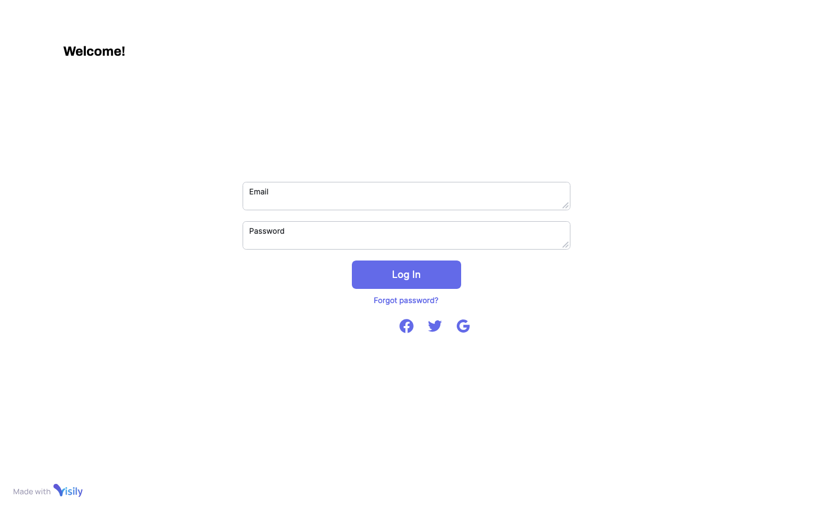
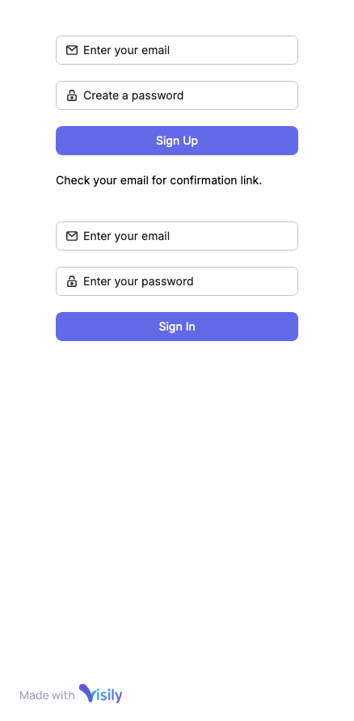

### JAM Architecting
><small>JAM Architecting Workout</small>

#### 1. Objectives

To assess JAM-stack development basics: planning, design, prototyping and implementation as a complex workout.

This repository provides a concise description of an imaginary _Event Booking System_ (EBS), introducing possible solutions
for implementing the said EBS, plus, has references to another github repository with some basic Next.js (React.js) application,
which may serve as scaffolding for a full-fledged web-application backed-up with _Sanity CMS_.

#### 2. Event Booking System Overview


The overall flowchart of EBS processes to be implemented with the application looks as following (see the diagram below):


This particular EBS should consists of:

1. Role-based Access Control system built on top of Sanity CMS
2. Redis DB instance should keep users' event records
3. Browser-based application should provide users to their bookings 
 
All these parts are connected as below:

````
+---------------------+        +---------------------+    
|    Sanity CMS       | -----> |  Role-based Access  | <--+
| (Content Management)|        |     Control (RBAC)  |    |
+---------------------+        +---------------------+    |   
                                      |                   |
                                      |                   |
                              +------------------+        |
                              |   Redis DB       | <------+    
                              | (Event Records)  |        |    
                              +------------------+        |    
                                                      +---------------------+    
                                                      | User Authentication |    
                                                      | (JWT, Next-Auth via |    
                                                      |    Browser App)     |    
                                                      +---------------------+    
                                                            ^      |   
                                                            |      v  
                                              +--------------------------------------+
                                              |       Browser App (Next + React)     |
                                              |  (User Auth + Bookings Management)   |
                                              +--------------------------------------+
                                                      |
                                                      v
                                         +----------------------+
                                         |      Admin Panel     |
                                         |   (Users, Events)    |
                                         +----------------------+


````

#### 3. DBs & Data Models

##### ___RBAC DB of Sanity CMS___

The data models for Sanity DB are *generated* with Sanity Studio: check the [RBAC sample](https://github.com/movapages/mini-login/blob/main/sanity-studio/schemaTypes/rbac.ts)
and [faked user data](https://github.com/movapages/mini-login/blob/main/faked-data/user-list.json) (JSON format). 

All EBS users are authenticated against the DB. Check [Next+React application repo](https://github.com/movapages/mini-login) 
for the project folder and file structure, etc.

##### ___Redis DB Basic structure___

Redis DB interconnectivity fits in Next.js capabilities with the mediation of [redis](https://www.npmjs.com/package/redis) package. However, it may be useful even with Redis to implement kind of caching mechanism, if the need arises.

The EBS DB storage:

````
 +-------------------------------+        +-------------------------------+
 |          Event List           |        |       Event Booking           |
 +-------------------------------+        +-------------------------------+
 | id            (PK)            | <----- | event_id       (FK)           |
 | title                         |        | user_id                       |
 | notes                         |        +-------------------------------+
 | datetime                      |
 | owner_id                      |
 | status                        |
 +-------------------------------+
````

##### ___Redis DB Data Samples___
````
# Event -

event:123
  id       : 123
  title    : "Team Meeting"
  notes    : "Discuss project updates"
  datetime : "2024-10-20T15:30:00"
  owner_id : 1
  status   : "scheduled"

# Event Booking (Users who booked event 123) -

event_bookings:123
  1   # User ID 1 booked the event
  2   # User ID 2 booked the event
````

##### ___Redis DB CRUD Query Examples___

1. <ins>Create a new event</ins>

````
HMSET event:123 id 123 title "Team Meeting" notes "Weekly sync-up" datetime "2024-10-20T15:30:00" owner_id 1 status "scheduled"
````

2. <ins>Book an Event</ins>

````
SADD event_bookings:123 1  # User 1 books the event
SADD event_bookings:123 2  # User 2 books the event
````

3. <ins>List all users per event</ins>

````
SMEMBERS event_bookings:123
````

#### 4. UI Mockups, UI Libs

1. <ins>User Authentication</ins>



> <small><strong>NB:</strong> Mobile first design implementation should adhere to well-known best practices - one-column layout built on top of media queries, etc. Check the _login_ form sample below.</small>



2. <ins>Event Dashboard</ins>


3. <ins>Single Event View</ins>


4. <ins>Event Update</ins>


> <small><strong>NB:</strong> It's possible to make use of in-place editing for each field separately.</small>
 
5. <ins>Event Create</ins>


6. <ins>Admin Panel</ins>

Admin panel should employ the same framework of React components shared with User UI, namely: dashboard and single event view.
Plus, one more state to list all registered users (read-only mode).
For this it may suffice to widen the dashboard component API to enable it listing different data sets by means of extra configuration object.

It may happen the customer will require a hardened access control to the panel and resources pertained to it,
and separate (physically) this resource from common userland; it means this part may be hosted/deployed on a different domain/host, and 
reside in a separate repository, etc.

To make all sharable parts available for both applications and keep them in sync in the process of constant development, we may consider use of Nx monorepo...


#### 5. JAM-Stack PoC: Next-Auth + Sanity CMS

Please, check the [PoC repository](https://github.com/movapages/mini-login), where `package.json` file lists all
NPMs required along with its demo pages.


#### 6. Deliverables & Deployment

For the convenience's sake it is advised to put the whole system into Docker container, which makes possible the development
process as well as maintenance to be carried out separately, and update the production-ready container as frequently as needed.

However, in the event the EBS will require some scaling in the future, the orchestration option should be kept in mind.
It means that the deployment process may require somewhat different containerization schema, where every integral part
will have its own, separate docker container.


1. <ins>Admin Panel & EBS Web Application</ins>

The JAM-Stack EBS application, its client-side, which exists as git repo, should reside within Docker space on the
developer's OS file system. Doing this way the developer may freely keep working on the application, and, on the other hand,
the application may be bundled and containerized whenever required.

The container(s) having DB servers installed may be used as a part of local developer's environment.

2. <ins>*nix Server Environment</ins>

A basic docker container setup starts with `docker-compose.yml` (example):

````
version: '3.8'

services:
  # Sanity Studio (Database and CMS management)
  sanity:
    build: ./sanity
    container_name: sanity
    ports:
      - '3333:3333' # Sanity studio port
    environment:
      SANITY_CLI_VERSION: '@sanity/cli@latest'
      PROJECT_ID: ${SANITY_PROJECT_ID}
    volumes:
      - ./sanity:/app
    depends_on:
      - redis

  # Redis
  redis:
    image: redis:alpine
    container_name: redis
    ports:
      - '6379:6379' # Redis port
    volumes:
      - redis-data:/data

  # Next.js with SSR
  nextjs:
    build: ./next
    container_name: nextjs
    ports:
      - '3000:3000'
    environment:
      NEXT_PUBLIC_SANITY_PROJECT_ID: ${SANITY_PROJECT_ID}
      NEXT_PUBLIC_REDIS_HOST: redis
      NEXT_PUBLIC_REDIS_PORT: 6379
    volumes:
      - ./next:/app
    depends_on:
      - redis
      - sanity

  # Nginx as a reverse proxy
  nginx:
    image: nginx:latest
    container_name: nginx
    ports:
      - '80:80' # Public access to the app
    volumes:
      - ./nginx/default.conf:/etc/nginx/conf.d/default.conf
    depends_on:
      - nextjs

volumes:
  redis-data:
    driver: local

````
YML file _mentions_ `nginx.conf`, where nextjs server requires extra configuration (example):

````
server {
    listen 80;

    server_name localhost;

    location / {
        proxy_pass http://nextjs:3000;
        proxy_http_version 1.1;
        proxy_set_header Upgrade $http_upgrade;
        proxy_set_header Connection 'upgrade';
        proxy_set_header Host $host;
        proxy_cache_bypass $http_upgrade;
    }
}
````

To enable SSR for Next.js, there should be a separate `Dockerfile` (example):

````
# Base image
FROM node:18-alpine

WORKDIR /app

# Install dependencies
COPY package.json yarn.lock ./
RUN yarn install

# Copy source code
COPY . .

# Build the Next.js app
RUN yarn build

# Expose the port
EXPOSE 3000

# Start the app
CMD ["yarn", "start"]

````

To manage content under Sanity Studio with `@sanity/cli` another `Dockerfile` fragment should be added (example):

````
# Base image
FROM node:18-alpine

WORKDIR /app

# Install Sanity CLI and other dependencies
RUN npm install -g @sanity/cli

# Copy Sanity project
COPY . .

# Start Sanity Studio
CMD ["sanity", "start"]

````

Finally, basic `.env` file should contain all required creds: 

````
SANITY_PROJECT_ID=your-sanity-project-id
````

This fully containerized environment is capable of hosting the EBS.